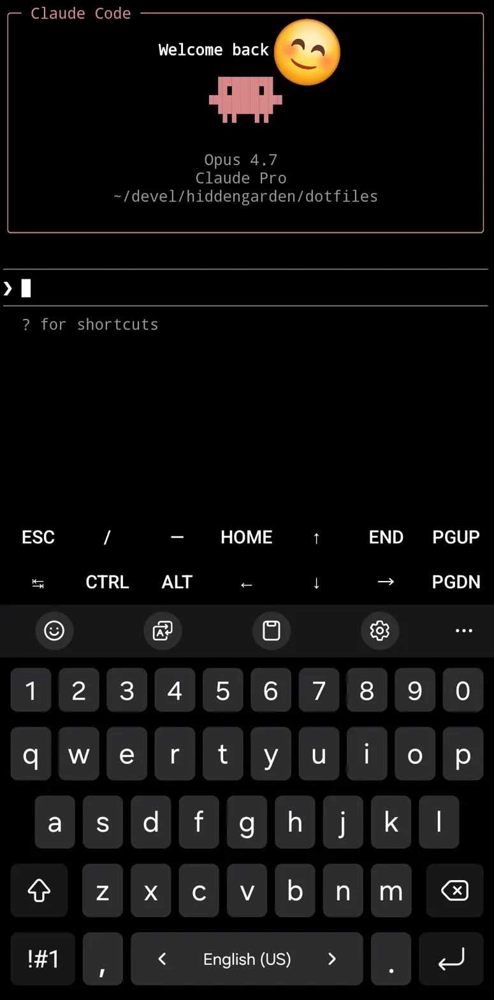

# dotfiles — reverse SSH to a home laptop

> Проект про удалённый доступ к домашнему ноуту — без лишних слов и без
> паранойи. Российский VPS за 350₽/мес оказался проще и надёжнее, чем
> зарубежные серверы с нестабильным соединением.
>
> Путь шёл по-талебовски — не бороться с ограничениями, а обтекать их.
> Пробовали сложные схемы, возвращались к простому. В итоге
> reverse SSH + autossh + fail2ban — минимум инструментов, максимум
> надёжности.
>
> *Like water.*

The home laptop sits on a residential ISP behind CGNAT. No public IP, no
admin access to the router, nothing to forward. This repo is the boringest
possible solution to "let me into my own machine from my phone": a
persistent reverse SSH tunnel from the laptop to a cheap domestic VPS,
plus a couple of `~/.ssh/config` aliases so the daily-driver command is
two characters (`ssh home`).

It is not a clever architecture. The point of writing it down is the
narrative — most guides for this kind of setup are five years stale and
don't account for what mobile clients actually look like in 2025+.

## Why not the usual stack

Tried before settling on this:

- **Tailscale.** Technically perfect. On Android it permanently occupies
  the single system VPN slot, which conflicts with every other VPN-shaped
  app on the phone. Non-starter for daily use.
- **WireGuard to a foreign VPS.** Throughput from this home network was
  inconsistent enough that interactive shells were painful. Worked some
  evenings, didn't work others. Not a profile worth debugging.
- **OpenSSH to a foreign VPS, port 22 and then 443.** TCP connected,
  then sessions stalled partway through the SSH handshake. Reproduced
  from multiple clients and ports — not a key, MTU, or config problem.
- **sing-box SOCKS5 + `ProxyCommand`.** Works perfectly from the laptop.
  Android SSH clients (Termux, Termius) don't natively understand SOCKS,
  so the device that needs remote access most is the one that can't use
  this.
- **Tor hidden service / Orbot.** Tor needs bridges from this network,
  and Orbot also wants the VPN slot. Two strikes.

The shape of the failures: anything that crossed the border with a novel
on-the-wire shape was unreliable in this environment, and anything that
needed a custom Android client was operationally annoying enough that I'd
stop using it after a week.

## Why the boring solution wins

Renting a small VPS *inside the country* (~350 ₽/mo) collapses all of
the above:

- Plain OpenSSH on port 22. No custom protocol, no client tweaks, no
  third-party app on the phone — just `ssh` from Termux.
- Low RTT, no border to cross at all for the data path.
- Works from every stock SSH client on every OS.
- Doesn't compete for the Android VPN slot, because there is no VPN.

This is "be water" engineering: stop fighting the channel and route
around the parts that resist. There is nothing exotic about a reverse
SSH tunnel; the win was admitting that the elaborate setups were costing
more in maintenance than they returned in features.

## Architecture

```
[ Android / laptop / anywhere ]  --ssh-->  [ VPS:22 root ]  <--reverse tunnel--  [ home laptop ]
                                                  |
                                       127.0.0.1:${TUNNEL_PORT}  --forwards-->  home laptop sshd
```

The home laptop holds open a persistent reverse tunnel to the VPS as a
restricted, no-shell user `tunnel`. Anyone with a key authorized as
`root@vps` can then `ssh home` (`ProxyJump` is wired into `ssh/config`).

## Why autossh, not plain ssh + `Restart=always`

This is the part I wish someone had told me up front.

First version of the systemd unit was straightforward:

```
ExecStart=/usr/bin/ssh -N -R 2222:localhost:22 tunnel@VPS
Restart=always
```

It worked at the desk. Died the first time the laptop closed its lid,
roamed to a different network, and woke up. The failure mode is unkind:
`ssh` doesn't notice that the underlying TCP is gone, the process keeps
running, systemd sees a live process, `Restart=always` never fires, and
the tunnel sits there *appearing* alive but routing nothing.

Adding `ServerAliveInterval=30 ServerAliveCountMax=3` made `ssh` actually
exit on dead links, which let systemd restart it. The journal then
accumulated **642 restart cycles in a single night** — every micro
network blip was a full SSH cold start.

`autossh` is the same monitoring loop, but inside one long-lived
supervisor process: it detects the dead connection, reconnects in-place,
and systemd never sees a flap. The unit becomes:

```
Environment=AUTOSSH_GATETIME=0
ExecStart=/usr/bin/autossh -M 0 -N -R ${TUNNEL_PORT}:localhost:22 \
  -i ~/.ssh/id_tunnel \
  -o ServerAliveInterval=30 -o ServerAliveCountMax=3 \
  -o ExitOnForwardFailure=yes \
  ${VPS_USER}@${VPS_HOST}
Restart=always
```

`-M 0` disables autossh's own monitoring port (it's largely redundant
once you have `ServerAliveInterval`). `AUTOSSH_GATETIME=0` tells autossh
not to give up if the very first connection on boot fails — useful when
the unit comes up before the network is fully ready.

## Layout

```
dotfiles/
├── bin/
│   └── install                    # render templates from .env, install
├── ssh/
│   └── config                     # template -> ~/.ssh/config
├── systemd/
│   └── reverse-tunnel.service     # template -> /etc/systemd/system/  (laptop only)
├── .env.example                   # copy to .env and fill in
├── .gitignore
└── README.md
```

All host-specific values (IP, usernames, port) live in `.env` and are
substituted into the templates by `bin/install`. The repo itself contains
no IPs, no usernames, no keys.

## Prerequisites

- `gettext` for `envsubst`: `pacman -S gettext` / `apt install gettext-base`
  / `pkg install gettext` (Termux)
- `openssh`, plus `autossh` on the home laptop only

## Configure

```bash
cp .env.example .env
$EDITOR .env        # set VPS_HOST, VPS_USER, HOME_USER, TUNNEL_PORT
```

## Bootstrap a client (laptop, desktop, Termux)

```bash
bin/install ssh

# Generate an interactive key and authorize it on the VPS as root
ssh-keygen -t ed25519 -f ~/.ssh/id_ed25519 -N '' -C "$(whoami)@$(hostname)"
ssh-copy-id -i ~/.ssh/id_ed25519.pub root@$(grep ^VPS_HOST .env | cut -d= -f2)

ssh vps  hostname
ssh home hostname        # works once the home laptop's tunnel is up
```

## Bootstrap the home laptop (the side that holds the tunnel open)

```bash
sudo pacman -S --needed autossh

# Tunnel key — separate from any interactive key
ssh-keygen -t ed25519 -f ~/.ssh/id_tunnel -N '' -C "tunnel@$(hostname)"
```

On the VPS, one-time, as root:

```bash
useradd -m -s /usr/sbin/nologin tunnel
install -d -m 700 -o tunnel -g tunnel /home/tunnel/.ssh
cat > /home/tunnel/.ssh/authorized_keys <<'KEY'
restrict,port-forwarding,permitlisten="2222" ssh-ed25519 AAAA... tunnel@<host>
KEY
chown tunnel:tunnel /home/tunnel/.ssh/authorized_keys
chmod 600 /home/tunnel/.ssh/authorized_keys
```

`restrict,port-forwarding,permitlisten=...` denies shell, PTY, agent
forwarding, X11, and any remote forward other than the configured tunnel
port. Combined with the `nologin` shell, this key has no useful capability
beyond holding the one specific port open.

Back on the laptop:

```bash
bin/install tunnel
sudo systemctl enable --now reverse-tunnel.service
systemctl status reverse-tunnel.service
```

## Android (Termux)

```bash
pkg install openssh gettext git
git clone <this-repo> ~/dotfiles && cd ~/dotfiles
cp .env.example .env && $EDITOR .env
bin/install ssh

ssh-keygen -t ed25519 -f ~/.ssh/id_ed25519 -N ''
# Add ~/.ssh/id_ed25519.pub to:
#   - root@vps:~/.ssh/authorized_keys      (so ProxyJump can hop)
#   - ${HOME_USER}@home:~/.ssh/authorized_keys  (so the inner login works)

ssh home
```

For terminal apps that don't read `~/.ssh/config` (e.g. Termius), point
them at `${VPS_HOST}:22 root` and run
`ssh -p ${TUNNEL_PORT} ${HOME_USER}@localhost` from inside the VPS shell.

## VPS hardening

Already applied:

- fail2ban, `sshd` jail, `bantime=1h findtime=10m maxretry=5`
- Tunnel user has `nologin` shell and `permitlisten` restriction
- `id_tunnel` is *only* authorized as the `tunnel` user — root can't be
  reached with that key

Optional next step: `PasswordAuthentication no` in `/etc/ssh/sshd_config`.
Always verify key login from a **second** SSH session before
`systemctl reload sshd` (never `restart` an in-use sshd — and never
disable password auth from your only console without a second session
already proven to work).

## Verify

After a reboot of the laptop:

```bash
systemctl status reverse-tunnel.service
journalctl -u reverse-tunnel.service -n 20 --no-pager
```

From the VPS:

```bash
ss -tnlp | grep ":${TUNNEL_PORT} "
ssh -p ${TUNNEL_PORT} ${HOME_USER}@localhost
```

From any client:

```bash
ssh home
```

## The payoff

`ssh home` from the phone, then `claude` in the terminal. Same
toolchain, same shell history, same project tree as at the desk —
from a train, a café, a borrowed laptop, whatever's nearby. That's
the whole reason this exists.

<p align="center">
  
</p>
